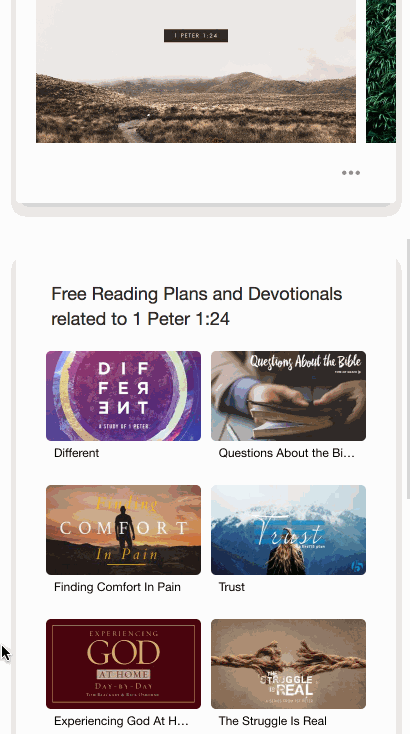
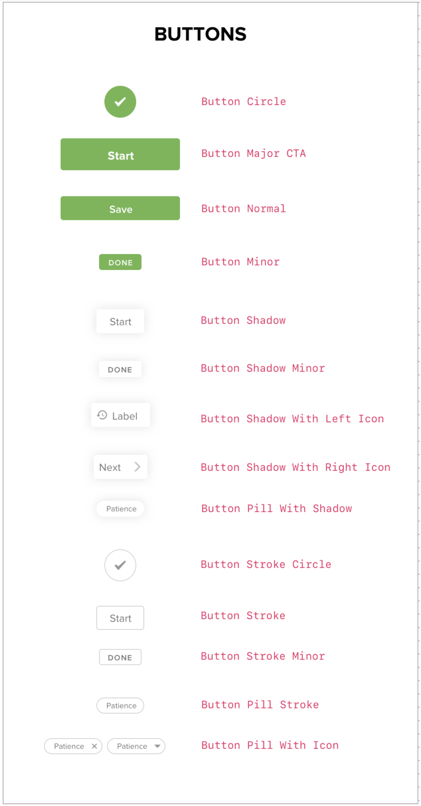

# Melos: The YouVersion React Component Library

[](https://codeclimate.com/github/lifechurch/melos/maintainability)

This project sets the standard for user interfaces on various YouVersion web
projects, containing many of the pieces that come together to create a clean,
simple and engaging user experience on Bible.com.

&nbsp;
<p align="center">
  
</p>
<p align="center">
  Example components in a mobile view
</p>


## Usage

If you want to start using these components right away, here's a brief intro
and a couple examples. You can see all of the available components, and
examples with usage, in our [Storybook for this library][our-storybook].

If you're looking to develop or add to this collection of components, see
the [Development](#development) section of this document.

### Getting Started

1. Install these components for use, by running

```
npm install @youversion/melos
```

2. Import the component you want to use...

```
import Card from '@youversion/melos/components/containers/Card'
```

3. Use the Component somewhere!

```
<div>
    <Card>
        Contents in a card component!
    </Card>
</div>
```

For usage examples of each of the components in this library, see [our Storybook][our-storybook].

## Test Drive all Components in a Sandbox Environment with React Storybook


We've built [React Storybook](https://storybook.js.org/) into our repo. This
allows us to create a centrally located sandbox where developers can discover
new components and test drive them using different prop combinations before
using them in their projects.

To see the complete collection of components, code examples, and test-drive them live, [see our Storybook][our-storybook].

## Available Components

See the complete list of available components, and test drive them all in our [Storybook][our-storybook].

Our components are organized into categories, based on their normal usage patterns. This hopefully makes them easier to find and utilize here and in the Storybook.


### Standardized Typography

Components for body copy, captions, headings (1 - 3), titles and links. By using these components throughout our projects, we create a standard for typography that adheres to our style guide.


### Convenient Layouts

These components are useful when designing layouts. They provide simple components for creating complex or frequently used layout patterns (such as 'vertical layouts evenly spaced' or 'fixed left and right content with a centered title')


### Links and Buttons

Standardized way of displaying, links, buttons, icon/image buttons, etc.




### Logos

Set of third-party and internal logos in SVG format, wrapped as React components with props for height, width and fill.


### Icons

Collection of icons currently being used in our web apps, in SVG format, wrapped as React components with props for height, width and fill.


### Media Queries

Standard set of media query breakpoints and pre-defined ranges for small, medium, large and x-large screens. They're defined in Javascript for use with our dynamically generated CSS (via Glamor and Glamorous).


### Forms

Standard components for handling form input. Inputs, Selects, Textareas and a Debounced higher order component.


### Containers

Currently, just a simple Card component for wrapping UI elements in a card.


### Utility Functions

A handy set of utility functions that we use in multiple places to make calculations or parse data such as converting arrays to object, fast searching/filtering long lists in the browser, darken/lighten hex colors by percent, monitor scroll position, monitor browser width, and more.


## CSS, Themes, and Dynamically Generated CSS using Glamor and Glamorous

Each component fully encapsulates all of the HTML, CSS and Javascript that it needs to exist. No need for external CSS, LESS or SASS files. Glamorous generates dynamic class names on the fly and inserts the resulting CSS rules into the `<head>`. This makes our page payloads much more efficient, requiring a user to download only the exact amount of CSS required to render the components within the page.

### Our Default Themes

All of our components have a default theme that we use in our own web apps and websites, such as [Bible.com](https://www.bible.com). Our themes are broken down into two areas.

- **Style Constants** : a Javascript object which defines all of the font weights, colors, margin, padding, line heights, etc. that will be used by our components

```Javascript
{
  constants: {
    fontFamily: {
      primary: '"proxima-nova",ArialMT,"Helvetica Neue",Arial,"Liberation Sans",FreeSans,sans-serif',
    },
    fontWeight: {
      normal: 400,
      semibold: 600,
      bold: 700
    },
    color: {
      text: 'black',
      muted: '#777777',
      primary: '#6AB750',
      light: 'white'
    },
    radius: {
      medium: 4
    },
    border: {
      thin: 'solid 1px #ddd'
    },
    fontSize: {
      xsmall: 10,
      small: 12,
      default: 16,
      medium: 18,
      large: 24,
      xlarge: 30
    },
    lineHeight: {
      medium: '24px'
    },
    letterSpacing: {
      xsmall: 2
    },
    padding: {
      none: 0,
      medium: 12
    },
    margin: {
      none: 0
    }
  }
}
```

- **Component Style Map Functions** : a function for each component that maps which style constants get applied to which style properties on a component. The functions have two arguments: `theme` and `props`. `theme` contains value of the `constants` key in your theme object, merged with the default constants. `props` is an object containing the props passed into your component. Here's an example:

```Javascript
{
  Heading1: (theme, props) => {
    const { muted } = props
    return {
      fontFamily: theme.fontFamily.primary,
      fontWeight: theme.fontWeight.bold,
      fontSize: theme.fontSize.xlarge,
      color: muted ? theme.color.muted : theme.color.text,
      padding: theme.padding.none,
      margin: theme.margin.none
    }
  }
}
```

### Putting it Together in a Custom Theme
You can mix and match any combination of style constants and style-mapping functions to create a custom theme. You only have to supply the parts that you actually want to override. For example, you can just change one thing, like this:

```Javascript
const customTheme = {
  constants: {
    fontFamily: {
      primary: 'AppleGothic'
    }
  }
}
```

Or, you can replace more, with something like this:

```Javascript
const customTheme2 = {
  constants: {
    fontFamily: {
      primary: 'Avenir Next'
    },
    color: {
      text: 'olivegreen',
      muted: 'darkyellow',
      primary: '#483D8B',
      light: 'white'
    },
    fontSize: {
      medium: 16
    }
  },
  ButtonMajor: (theme) => {
    return {
      fontSize: theme.fontSize.xlarge
    }
  }
}
```

### Applying Your Theme to components
First, import our `<Theme />` component:

```Javascript
import Theme from '@youversion/melos/dist/components/themes/Theme'
```

Then, define a variable containing your custom theme, like this:

```Javascript
const customTheme = {
  constants: {
    fontFamily: {
      primary: 'AppleGothic'
    }
  }
}
```

Next, set `definition` prop on the `<Theme/> ` component to your custom theme like this:

```
<Theme definition={customTheme}></Theme>
```

Place components inside the `<Theme />` component to have your custom theme applied to them:

```
<Theme definition={customTheme}>
  <Card>
    <VerticalSpace space={15}>
      <Heading1>Heading One</Heading1>
      <Heading1 muted>Heading One</Heading1>
      <Heading2>Heading Two</Heading2>
      <Heading2 muted>Heading Two</Heading2>
      <Heading3>Heading Three</Heading3>
      <Heading3 muted>Heading Three</Heading3>
      <Body>Body</Body>
      <Body muted>Body</Body>
      <Caption1>Caption One</Caption1>
      <Caption1 muted>Caption One</Caption1>
      <Caption2>Caption Two</Caption2>
      <Caption2 muted>Caption Two</Caption2>
      <Title>Title</Title>
      <Title muted>Title</Title>
      <LinkText href="https://www.bible.com">Link Text</LinkText>
      <Button>Button</Button>
      <ButtonMajor>Button Major</ButtonMajor>
    </VerticalSpace>
  </Card>
</Theme>
```

### Under the Hood
Under the hood we're using [Glamorous](https://glamorous.rocks/) to generate `<style>` blocks inside `<head>`. You can read the [Glamorous docs for Themes](https://glamorous.rocks/advanced/#theming) to get a more information about what's actually happening.


## Development

Before starting, please refer to our [Contribution Guidelines][contributing].

### Using Storybook to develop these components

We recommend the use of React Storybook for developing these components.

1. Dependencies! In the project root, run `npm install`.

2. Start the server:

        $ npm run storybook

3. Open browser to http://localhost:8080/.

4. Develop components in their respective folders (`/src/components/{component-name}/`).

5. Write stories for your components in their respective `stories` folder. E.g., `/src/components/{component-name}/stories/{name}.stories.js`.

6. Write tests for your component in their respective `__tests__` folder. E.g., `/src/components/{component-name}/__tests__/{name}.unit.test.js`.

For more information on Storybook specifically, see [the Storybook site][storybook].

### Run Tests

    npm run test

### Generate a Production Build

    npm run compile

### Watch for Code Changes and Automatically Rebuild During Development

    npm run watch


## Contributing

Please check out our [Contribution Guidelines][contributing] for detailed
information on how you can lend a hand.

## License

[Apache License 2.0](./LICENSE)


## How did you come up with the name mélos?

In the Bible, [1 Corinthians 12:12](https://www.bible.com/bible/116/1CO.12.12.nlt) says...

> “For just as the body is one and has many members [ mélos ], and all the members of the body, though many, are one body, so it is with Christ.”

"mélos" is the Greek word translated as "members" or "parts" in this verse.

We liked the idea of many parts (or mélos) working together to build something bigger. That's the way the Church is being built, and that's also the way good web applications are built - each of the mélos doing the work it was designed for.


[our-storybook]: https://lifechurch.github.io/melos/ "YouVersion React Component Library Storybook"
[contributing]: /CONTRIBUTING.md "YouVersion React Component Library Contribution Guidelines"
[storybook]: https://storybook.js.org/
